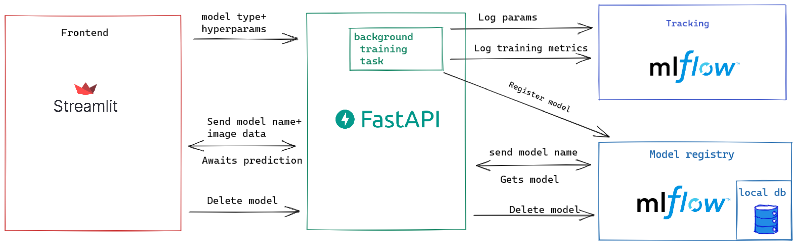
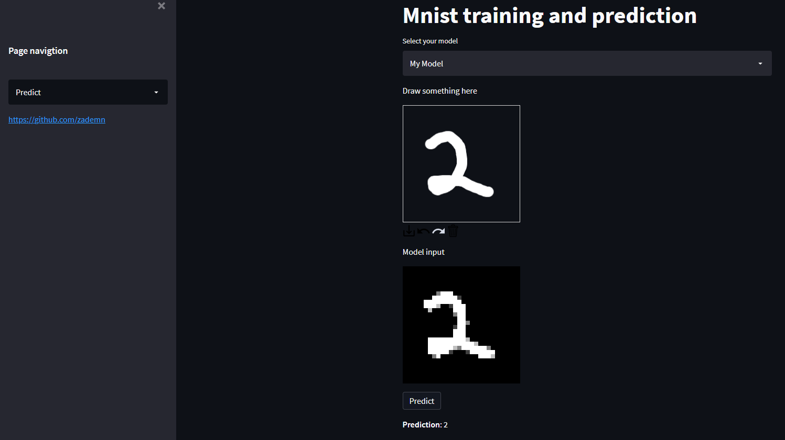

# Fastapi + MLflow + streamlit

Setup env. I hope I covered all.
```bash
pip install -r requirements.txt
```
# Start app
Go in the root dir and run these

Streamlit
```bash
streamlit run frontend/streamlit_main.py
```

FastAPI 
```
uvicorn backend.main:app
```

MLflow UI
```bash
mlflow ui --backend-store-uri sqlite:///bakckend.db
```

# Architecture


# UI 


## TODO
- [ ] Testing
- [ ] Maybe add celery instead of that background task? (Needs extra configs though)

